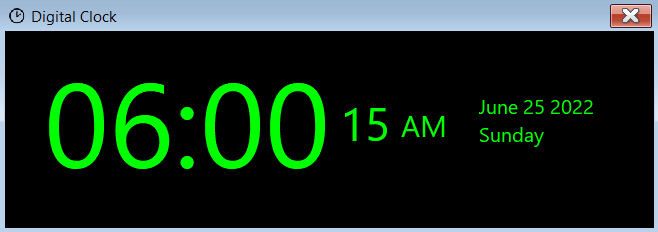

# WinForms-Digital-Clock
A digital clock app developed in Windows Forms.



## Installation
- Clone the source code:

```
git clone https://github.com/aydindogukan/WinForms-Digital-Clock
```

- Open the `WinForms-Digital-Clock.sln` file in Visual Studio.
- Run the source code.